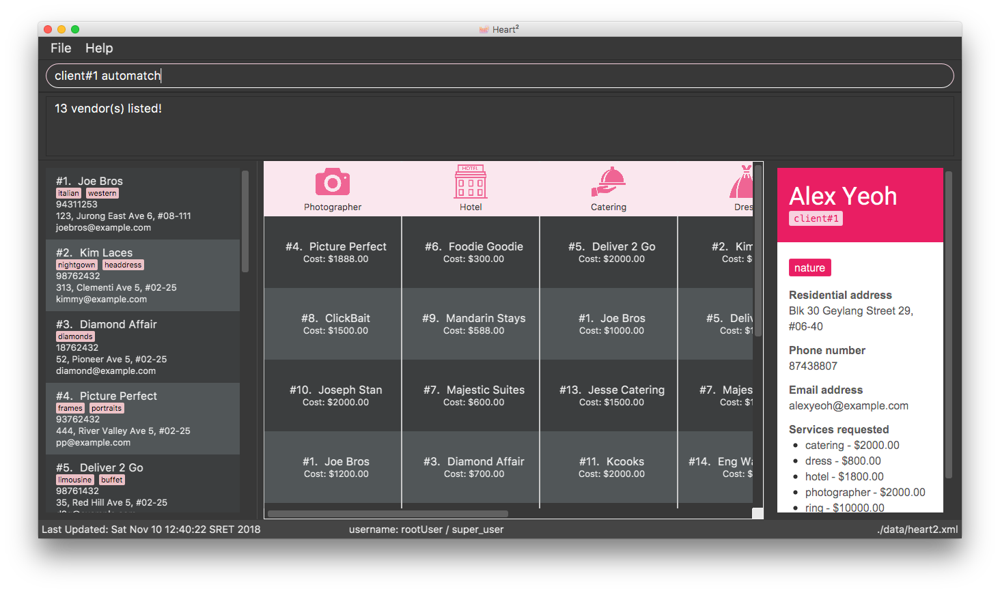

= Heart²
ifdef::env-github,env-browser[:relfileprefix: docs/]

_Enterprise Wedding Management System_

https://travis-ci.org/CS2103-AY1819S1-F10-3/main[image:https://travis-ci.org/CS2103-AY1819S1-F10-3/main.svg?branch=master[Build Status]]
https://ci.appveyor.com/project/liaujianjie/main[image:https://ci.appveyor.com/api/projects/status/ycx5vnhfck9tp9ae?svg=true[Build status]]
https://coveralls.io/github/CS2103-AY1819S1-F10-3/main?branch=master[image:https://coveralls.io/repos/github/CS2103-AY1819S1-F10-3/main/badge.svg?branch=master[Coverage Status]]
https://www.codacy.com/app/liaujianjie/main?utm_source=github.com&utm_medium=referral&utm_content=CS2103-AY1819S1-F10-3/main&utm_campaign=Badge_Grade"[image:https://api.codacy.com/project/badge/Grade/cd2ccc2fc61c4afdac9c3f89a3345a65[Codacy Badge]]
https://gitter.im/se-edu/Lobby[image:https://badges.gitter.im/se-edu/Lobby.svg[Gitter chat]]

ifdef::env-github[]

endif::[]

ifndef::env-github[]
image::images/Ui.png[width="600"]
endif::[]

* This is a desktop Wedding Planner application. It has a GUI but most of the user interactions happen using a CLI (Command Line Interface).
* This Wedding Planner application is intended for Wedding Planner companies.
* It matches clients with their service providers based on various client requests.

== Site Map

* <<UserGuide#, User Guide>>
* <<DeveloperGuide#, Developer Guide>>
* <<AboutUs#, About Us>>
* <<ContactUs#, Contact Us>>

== Acknowledgements

* This application was adapted from a SE-EDU initiative: https://github.com/se-edu/[AddressBook-Level4]
* Libraries used: https://github.com/TestFX/TestFX[TextFX], https://bitbucket.org/controlsfx/controlsfx/[ControlsFX], https://github.com/FasterXML/jackson[Jackson], https://github.com/google/guava[Guava], https://github.com/junit-team/junit5[JUnit5]

== Licence : link:LICENSE[MIT]
